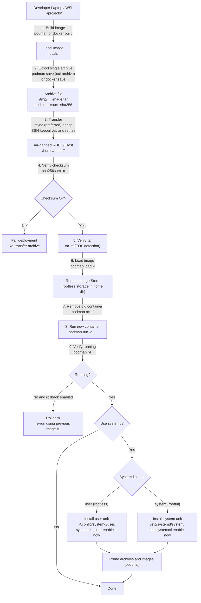

# deploy-oci.sh

A **production-grade deployment script** for shipping Node.js applications as a **single OCI image archive**
from a development machine to **air‑gapped RHEL 9 servers** using **Podman**.

This README is split into **Developer** and **Operator** sections and includes a **deployment flow diagram**.

---

## Table of Contents

1. Overview  
2. Architecture & Flow Diagram  
3. Developer Guide  
4. Operator Guide  
5. Rootless vs Rootful Podman  
6. Rollback & Pruning  
7. Dry‑Run & Safety  
8. Troubleshooting  
9. Design Principles  

---

## 1. Overview

`deploy-oci.sh` automates the **entire lifecycle** of deploying a containerized Node.js app into an
**air‑gapped RHEL9 environment**:

- Local build
- Single‑file image export
- Reliable transfer
- Integrity verification
- Podman load
- Container restart
- Optional systemd management
- Optional rollback and pruning

The script is optimized for **rootless Podman** (recommended) but supports **rootful** deployments.

---

## 2. Architecture & Flow Diagram

```
┌────────────────────────────┐
│  Developer Laptop / WSL    │
│                            │
│  ~/projects/<app>          │
│   ├─ Containerfile         │
│   ├─ package.json          │
│   └─ server.js             │
│                            │
│  deploy-oci.sh             │
└─────────────┬──────────────┘
              │
              │ 1. podman/docker build
              ▼
┌────────────────────────────┐
│ Local OCI Image            │
│ local/<app>:latest         │
└─────────────┬──────────────┘
              │
              │ 2. podman save (single tar)
              ▼
┌────────────────────────────┐
│ /tmp/<app>_<ts>.image.tar  │
│ + sha256 checksum          │
└─────────────┬──────────────┘
              │
              │ 3. rsync/scp (with keepalive)
              ▼
┌────────────────────────────────────────┐
│ Air‑Gapped RHEL 9 Server               │
│                                        │
│ /home/<user>/node/<app>/               │
│   ├─ image.tar                         │
│   └─ image.tar.sha256                  │
│                                        │
│ 4. sha256sum -c                        │
│ 5. tar -tf (EOF detection)             │
│ 6. podman load                         │
│ 7. podman run                          │
│ 8. systemd (optional)                  │
└────────────────────────────────────────┘
```

---

## App Assumptions

By default, the script assumes:

- Node.js **20+**
- Production start command: **`npm start`**
- Development command: `npm run dev`
- App listens on port **8080** unless overridden

If an app directory does **not** contain a `Containerfile` or `Dockerfile`,
the script will **auto-generate a default Containerfile**.

### Auto-Generated Default Containerfile

```Dockerfile
FROM registry.access.redhat.com/ubi9/nodejs-20:latest
WORKDIR /app

COPY package*.json ./
RUN npm ci --omit=dev --no-audit --no-fund

COPY . .
ENV NODE_ENV=production
EXPOSE 8080

CMD ["npm", "start"]
```

> `npm run dev` is intentionally **never** used in containers.

---

## Basic Usage

```bash
deploy-oci.sh   --app <app-name>   --host <rhel9-host>
```

---

## Common Options

| Option | Description |
|------|-------------|
| `--app` | App directory under `projects-dir` |
| `--host` | Target host |
| `--remote-user` | SSH user on target |
| `--projects-dir` | Local base directory |
| `--remote-dir` | Remote base directory |
| `--port` | Host:container port mapping |
| `--env-file` | Remote env file |
| `--dry-run` | Show actions without executing |
| `--yes` | Skip confirmation prompt |

---

## systemd Integration

Enable systemd management:

```bash
--use-systemd
```

### systemd Scope

```bash
--systemd-scope auto    # default
--systemd-scope user    # rootless Podman
--systemd-scope system  # rootful Podman
```

### Rootless Podman (Recommended)

- Uses **user services**
- Units stored in:
  ```
  ~/.config/systemd/user/
  ```
- Managed with:
  ```bash
  systemctl --user
  ```

### Enable Linger (Boot Persistence)

For rootless services to start at boot:

```bash
--enable-linger
```

Equivalent to:
```bash
sudo loginctl enable-linger <user>
```

---

## Rollback

Enable rollback support:

```bash
--rollback
```

If the new container fails to start:
- Previous image ID is restored
- Ports and env files are preserved

---

## Pruning

### Remote archives
```bash
--keep-archives 5
```

### Remote images
```bash
--keep-images 3
```

Disable pruning:
```bash
--keep-archives 0 --keep-images 0
```

---

## Safety Checks

Before loading images on the remote host, the script enforces:

- `sha256sum -c`
- `tar -tf <archive>`

This prevents corrupted transfers from reaching production.

---

## Example: Production Deployment

```bash
deploy-oci.sh   --app Team-Nexus   --host dblvlecdd0000a   --use-systemd   --enable-linger   --rollback   --yes
```

---

## Design Principles

- Fail fast
- Verify everything
- Rootless by default
- One-file transfers
- Rollback must be cheap

---


## Target Environment

- Developer: WSL / Linux
- Runtime: Air-gapped RHEL 9
- Container Engine: Podman (rootless)
- Service Manager: systemd user units

---

## Known Pitfalls / FAQs

### Q: My container starts and immediately exits
**Cause:**  
The application does not define a valid `npm start` script.

**Why:**  
Containers created by `deploy-oci.sh` always start with:
```bash
npm start
```

**Fix:**  
Ensure `package.json` contains a production start script, for example:
```json
{
  "scripts": {
    "start": "node server.js",
    "dev": "nodemon server.js"
  }
}
```

---

### Q: Should I use `npm run dev` in containers?
**Answer:** No.

**Why:**  
- `npm run dev` usually depends on `devDependencies`
- Containers are built with:
  ```bash
  npm ci --omit=dev
  ```
- Dev mode often enables file watchers, extra memory usage, and binds to localhost

**Best practice:**  
- Use `npm run dev` only for local development
- Use `npm start` in all containers

---

### Q: The service works manually but does not start after reboot
**Cause:**  
Rootless systemd user services require **linger** to be enabled.

**Check:**
```bash
loginctl show-user <user> -p Linger
```

**Fix:**
```bash
sudo loginctl enable-linger <user>
```

Or deploy with:
```bash
--enable-linger
```

---

### Q: The container starts but nothing is listening on the port
**Causes:**
- Application is listening on a different port
- Incorrect host:container port mapping

**Check application port:**
- Inspect code (`app.listen`, `process.env.PORT`)
- Check logs:
  ```bash
  podman logs <container>
  ```

**Fix:**
Specify the correct mapping:
```bash
--port <hostPort>:<containerPort>
```

Example:
```bash
--port 8080:3000
```

---

### Q: Binding to ports 80 or 443 fails
**Cause:**  
Rootless Podman cannot bind to privileged ports (<1024).

**Solutions:**
- Use high ports (8080, 8443)
- Front with nginx/httpd
- Use rootful Podman (not recommended unless required)

---

### Q: `podman load` fails with “unexpected EOF”
**Cause:**  
The image archive was truncated during transfer.

**How the script protects you:**
- Verifies SHA256 checksum
- Runs `tar -tf` before `podman load`

**If it still happens:**
- Ensure sufficient disk space on `/home` and `/var/tmp`
- Prefer rsync:
  ```bash
  --transfer rsync
  ```

---

### Q: Deployment fails with permission errors
**Common causes:**
- Missing sudo rights (linger or system units)
- Writing systemd units in the wrong scope

**Guidance:**
- Rootless Podman → user systemd units
- Rootful Podman → system systemd units
- Let the script auto-detect:
  ```bash
  --systemd-scope auto
  ```

---

### Q: I get SELinux-related errors
**Notes:**
- Current target environments often run SELinux in permissive mode
- In enforcing mode:
  - Volume mounts may require `:Z` or `:z`
  - Custom policies may be needed

**Check mode:**
```bash
getenforce
```

---

### Q: How do I see what the script will actually do?
Use dry-run mode:

```bash
deploy-oci.sh ... --dry-run
```

This prints every command without executing it.

---

### Q: How do I roll back manually?
If automatic rollback is disabled or fails:

```bash
podman images
podman rm -f <container>
podman run -d --name <container> <previous-image-id>
```

---

### Q: Can I use Docker instead of Podman locally?
Yes.

- Local engine can be Docker
- Remote engine is always Podman
- The script handles Docker archives automatically

---

## 3. Developer Guide

### 3.1 Requirements (Developer)

- Linux or WSL Ubuntu
- Podman **or** Docker
- Node.js project with:
  - `Containerfile` or `Dockerfile`
- Project layout:
  ```
  ~/projects/<app>/
  ```

### 3.2 Installing the Script

```bash
mkdir -p ~/bin
cp deploy-oci.sh ~/bin/deploy-oci.sh
chmod +x ~/bin/deploy-oci.sh
```

Ensure `~/bin` is in your PATH.

---

### 3.3 Basic Deployment Command

```bash
deploy-oci.sh   --app Team-Nexus   --host dblvlecdd0000a   --remote-user adm_tduncan28   --port 8080:8080
```

---

### 3.4 Production‑Grade Deployment

```bash
deploy-oci.sh   --app Team-Nexus   --host dblvlecdd0000a   --remote-user adm_tduncan28   --projects-dir /home/troy/projects   --port 8080:8080   --env-file /home/adm_tduncan28/node/Team-Nexus/Team-Nexus.env   --use-systemd   --systemd-scope auto   --enable-linger   --rollback   --keep-archives 7   --keep-images 5   --yes
```

---

### 3.5 Dry‑Run Mode

Preview all actions without making changes:

```bash
deploy-oci.sh   --app Team-Nexus   --host dblvlecdd0000a   --use-systemd   --dry-run
```

---

## 4. Operator Guide

### 4.1 Target Host Requirements

- RHEL 9.x
- Podman installed
- SSH access
- Rootless Podman **recommended**
- SELinux permissive or enforcing (script compatible)

### 4.2 Rootless Podman (Recommended)

Confirmed by:

```bash
podman info --format '{{.Host.Security.Rootless}}'
```

Benefits:
- No root container runtime
- User‑level systemd units
- Safer multi‑tenant operation

---

### 4.3 systemd Integration

#### User scope (rootless)

- Units stored in:
  ```
  ~/.config/systemd/user/
  ```
- Managed with:
  ```bash
  systemctl --user
  ```

#### Enable linger (required for boot startup)

```bash
sudo loginctl enable-linger <user>
```

The script can do this automatically using:

```bash
--enable-linger
```

---

### 4.4 Rootful Podman (Less Common)

- Units installed into:
  ```
  /etc/systemd/system/
  ```
- Requires sudo
- Enabled with:
  ```bash
  --systemd-scope system
  ```

---

## 5. Rollback & Pruning

### 5.1 Rollback

Enable rollback:

```bash
--rollback
```

If the new container fails:
- Script recreates the container using the **previous image ID**
- Preserves ports and env files

---

### 5.2 Pruning

Keep latest archives:

```bash
--keep-archives 5
```

Prune old unused images:

```bash
--keep-images 3
```

Disable pruning:

```bash
--keep-archives 0 --keep-images 0
```

---

## 6. Safety & Integrity

Before loading an image on the server:

- `sha256sum -c`
- `tar -tf` (detects truncated archives / EOF)

This prevents corrupted air‑gap transfers from reaching production.

---

## 7. Troubleshooting

### Container not running
```bash
podman logs <app> --tail 200
```

### systemd user service not starting at boot
```bash
loginctl show-user <user> -p Linger
```

### Port binding failure
- Rootless Podman cannot bind ports <1024
- Use 8080/8443 or a reverse proxy

---

## 8. Exit Codes

| Code | Meaning |
|----|--------|
| 0 | Success |
| 1 | Failure or rollback triggered |

---

## 9. Design Principles

- Fail fast
- Verify everything
- Trust nothing over the network
- Rootless by default
- Rollback must be cheap

---

**Author:** Troy Duncan  
**Target Environment:** WSL → Air‑Gapped RHEL 9 (Podman rootless)


### Mermaid Diagram (GitHub/GitLab)



