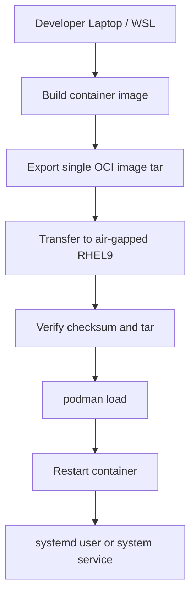

# deploy-oci.sh

`deploy-oci.sh` is a **production-grade deployment script** for shipping Node.js
applications as a **single OCI image archive** from a development machine to
**air-gapped RHEL 9 servers** using **Podman**.

This README documents the **deployment script itself**, not any specific app.

---

## Purpose

- Deploy Node.js apps into **air-gapped environments**
- Bundle runtime + dependencies into **one transferable file**
- Support **rootless Podman** (recommended) and **rootful Podman**
- Provide safe operations: integrity checks, rollback, pruning
- Standardize deployments across multiple apps

---

## High-Level Flow



---

## Requirements

### Local (Developer)
- Linux or WSL
- Podman **or** Docker
- rsync (recommended)
- SSH access to target host

### Remote (Target)
- RHEL 9
- Podman installed
- Rootless Podman recommended
- Optional sudo (for linger or system services)

---

## App Assumptions

By default, the script assumes:

- Node.js **20+**
- Production start command: **`npm start`**
- Development command: `npm run dev`
- App listens on port **8080** unless overridden

If an app directory does **not** contain a `Containerfile` or `Dockerfile`,
the script will **auto-generate a default Containerfile**.

### Auto-Generated Default Containerfile

```Dockerfile
FROM registry.access.redhat.com/ubi9/nodejs-20:latest
WORKDIR /app

COPY package*.json ./
RUN npm ci --omit=dev --no-audit --no-fund

COPY . .
ENV NODE_ENV=production
EXPOSE 8080

CMD ["npm", "start"]
```

> `npm run dev` is intentionally **never** used in containers.

---

## Basic Usage

```bash
deploy-oci.sh   --app <app-name>   --host <rhel9-host>
```

---

## Common Options

| Option | Description |
|------|-------------|
| `--app` | App directory under `projects-dir` |
| `--host` | Target host |
| `--remote-user` | SSH user on target |
| `--projects-dir` | Local base directory |
| `--remote-dir` | Remote base directory |
| `--port` | Host:container port mapping |
| `--env-file` | Remote env file |
| `--dry-run` | Show actions without executing |
| `--yes` | Skip confirmation prompt |

---

## systemd Integration

Enable systemd management:

```bash
--use-systemd
```

### systemd Scope

```bash
--systemd-scope auto    # default
--systemd-scope user    # rootless Podman
--systemd-scope system  # rootful Podman
```

### Rootless Podman (Recommended)

- Uses **user services**
- Units stored in:
  ```
  ~/.config/systemd/user/
  ```
- Managed with:
  ```bash
  systemctl --user
  ```

### Enable Linger (Boot Persistence)

For rootless services to start at boot:

```bash
--enable-linger
```

Equivalent to:
```bash
sudo loginctl enable-linger <user>
```

---

## Rollback

Enable rollback support:

```bash
--rollback
```

If the new container fails to start:
- Previous image ID is restored
- Ports and env files are preserved

---

## Pruning

### Remote archives
```bash
--keep-archives 5
```

### Remote images
```bash
--keep-images 3
```

Disable pruning:
```bash
--keep-archives 0 --keep-images 0
```

---

## Safety Checks

Before loading images on the remote host, the script enforces:

- `sha256sum -c`
- `tar -tf <archive>`

This prevents corrupted transfers from reaching production.

---

## Example: Production Deployment

```bash
deploy-oci.sh   --app Team-Nexus   --host dblvlecdd0000a   --use-systemd   --enable-linger   --rollback   --yes
```

---

## Design Principles

- Fail fast
- Verify everything
- Rootless by default
- One-file transfers
- Rollback must be cheap

---

## Maintainer

- Troy Duncan

---

## Target Environment

- Developer: WSL / Linux
- Runtime: Air-gapped RHEL 9
- Container Engine: Podman (rootless)
- Service Manager: systemd user units

---

## Known Pitfalls / FAQs

### Q: My container starts and immediately exits
**Cause:**  
The application does not define a valid `npm start` script.

**Why:**  
Containers created by `deploy-oci.sh` always start with:
```bash
npm start
```

**Fix:**  
Ensure `package.json` contains a production start script, for example:
```json
{
  "scripts": {
    "start": "node server.js",
    "dev": "nodemon server.js"
  }
}
```

---

### Q: Should I use `npm run dev` in containers?
**Answer:** No.

**Why:**  
- `npm run dev` usually depends on `devDependencies`
- Containers are built with:
  ```bash
  npm ci --omit=dev
  ```
- Dev mode often enables file watchers, extra memory usage, and binds to localhost

**Best practice:**  
- Use `npm run dev` only for local development
- Use `npm start` in all containers

---

### Q: The service works manually but does not start after reboot
**Cause:**  
Rootless systemd user services require **linger** to be enabled.

**Check:**
```bash
loginctl show-user <user> -p Linger
```

**Fix:**
```bash
sudo loginctl enable-linger <user>
```

Or deploy with:
```bash
--enable-linger
```

---

### Q: The container starts but nothing is listening on the port
**Causes:**
- Application is listening on a different port
- Incorrect host:container port mapping

**Check application port:**
- Inspect code (`app.listen`, `process.env.PORT`)
- Check logs:
  ```bash
  podman logs <container>
  ```

**Fix:**
Specify the correct mapping:
```bash
--port <hostPort>:<containerPort>
```

Example:
```bash
--port 8080:3000
```

---

### Q: Binding to ports 80 or 443 fails
**Cause:**  
Rootless Podman cannot bind to privileged ports (<1024).

**Solutions:**
- Use high ports (8080, 8443)
- Front with nginx/httpd
- Use rootful Podman (not recommended unless required)

---

### Q: `podman load` fails with “unexpected EOF”
**Cause:**  
The image archive was truncated during transfer.

**How the script protects you:**
- Verifies SHA256 checksum
- Runs `tar -tf` before `podman load`

**If it still happens:**
- Ensure sufficient disk space on `/home` and `/var/tmp`
- Prefer rsync:
  ```bash
  --transfer rsync
  ```

---

### Q: Deployment fails with permission errors
**Common causes:**
- Missing sudo rights (linger or system units)
- Writing systemd units in the wrong scope

**Guidance:**
- Rootless Podman → user systemd units
- Rootful Podman → system systemd units
- Let the script auto-detect:
  ```bash
  --systemd-scope auto
  ```

---

### Q: I get SELinux-related errors
**Notes:**
- Current target environments often run SELinux in permissive mode
- In enforcing mode:
  - Volume mounts may require `:Z` or `:z`
  - Custom policies may be needed

**Check mode:**
```bash
getenforce
```

---

### Q: How do I see what the script will actually do?
Use dry-run mode:

```bash
deploy-oci.sh ... --dry-run
```

This prints every command without executing it.

---

### Q: How do I roll back manually?
If automatic rollback is disabled or fails:

```bash
podman images
podman rm -f <container>
podman run -d --name <container> <previous-image-id>
```

---

### Q: Can I use Docker instead of Podman locally?
Yes.

- Local engine can be Docker
- Remote engine is always Podman
- The script handles Docker archives automatically

---


