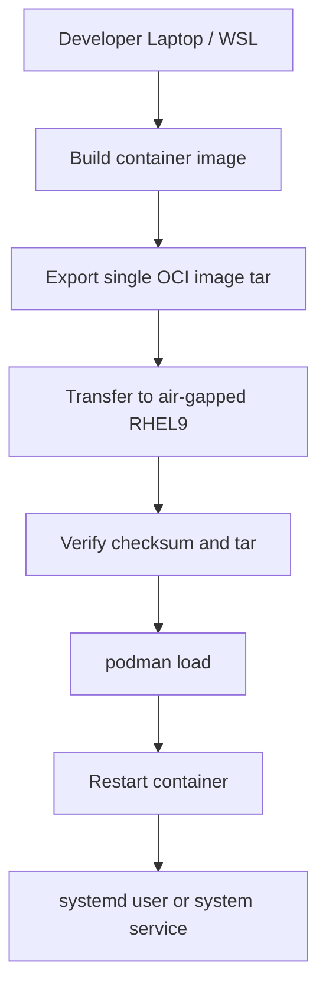

# deploy-oci.sh

`deploy-oci.sh` is a **production-grade deployment script** for shipping Node.js
applications as a **single OCI image archive** from a development machine to
**air-gapped RHEL 9 servers** using **Podman**.

This README documents the **deployment script itself**, not any specific app.

---

## Purpose

- Deploy Node.js apps into **air-gapped environments**
- Bundle runtime + dependencies into **one transferable file**
- Support **rootless Podman** (recommended) and **rootful Podman**
- Provide safe operations: integrity checks, rollback, pruning
- Standardize deployments across multiple apps

---

## High-Level Flow



---

## Requirements

### Local (Developer)
- Linux or WSL
- Podman **or** Docker
- rsync (recommended)
- SSH access to target host

### Remote (Target)
- RHEL 9
- Podman installed
- Rootless Podman recommended
- Optional sudo (for linger or system services)

---

## App Assumptions

By default, the script assumes:

- Node.js **20+**
- Production start command: **`npm start`**
- Development command: `npm run dev`
- App listens on port **8080** unless overridden

If an app directory does **not** contain a `Containerfile` or `Dockerfile`,
the script will **auto-generate a default Containerfile**.

### Auto-Generated Default Containerfile

```Dockerfile
FROM registry.access.redhat.com/ubi9/nodejs-20:latest
WORKDIR /app

COPY package*.json ./
RUN npm ci --omit=dev --no-audit --no-fund

COPY . .
ENV NODE_ENV=production
EXPOSE 8080

CMD ["npm", "start"]
```

> `npm run dev` is intentionally **never** used in containers.

---

## Basic Usage

```bash
deploy-oci.sh   --app <app-name>   --host <rhel9-host>
```

---

## Common Options

| Option | Description |
|------|-------------|
| `--app` | App directory under `projects-dir` |
| `--host` | Target host |
| `--remote-user` | SSH user on target |
| `--projects-dir` | Local base directory |
| `--remote-dir` | Remote base directory |
| `--port` | Host:container port mapping |
| `--env-file` | Remote env file |
| `--dry-run` | Show actions without executing |
| `--yes` | Skip confirmation prompt |

---

## systemd Integration

Enable systemd management:

```bash
--use-systemd
```

### systemd Scope

```bash
--systemd-scope auto    # default
--systemd-scope user    # rootless Podman
--systemd-scope system  # rootful Podman
```

### Rootless Podman (Recommended)

- Uses **user services**
- Units stored in:
  ```
  ~/.config/systemd/user/
  ```
- Managed with:
  ```bash
  systemctl --user
  ```

### Enable Linger (Boot Persistence)

For rootless services to start at boot:

```bash
--enable-linger
```

Equivalent to:
```bash
sudo loginctl enable-linger <user>
```

---

## Rollback

Enable rollback support:

```bash
--rollback
```

If the new container fails to start:
- Previous image ID is restored
- Ports and env files are preserved

---

## Pruning

### Remote archives
```bash
--keep-archives 5
```

### Remote images
```bash
--keep-images 3
```

Disable pruning:
```bash
--keep-archives 0 --keep-images 0
```

---

## Safety Checks

Before loading images on the remote host, the script enforces:

- `sha256sum -c`
- `tar -tf <archive>`

This prevents corrupted transfers from reaching production.

---

## Example: Production Deployment

```bash
deploy-oci.sh   --app Team-Nexus   --host dblvlecdd0000a   --use-systemd   --enable-linger   --rollback   --yes
```

---

## Design Principles

- Fail fast
- Verify everything
- Rootless by default
- One-file transfers
- Rollback must be cheap

---

## Maintainer

- Troy Duncan

---

## Target Environment

- Developer: WSL / Linux
- Runtime: Air-gapped RHEL 9
- Container Engine: Podman (rootless)
- Service Manager: systemd user units
